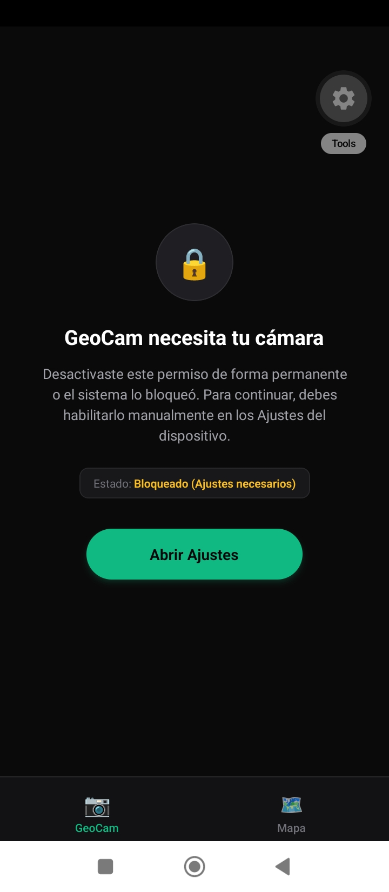
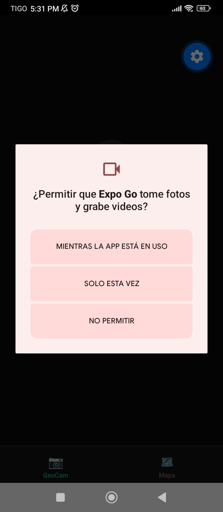
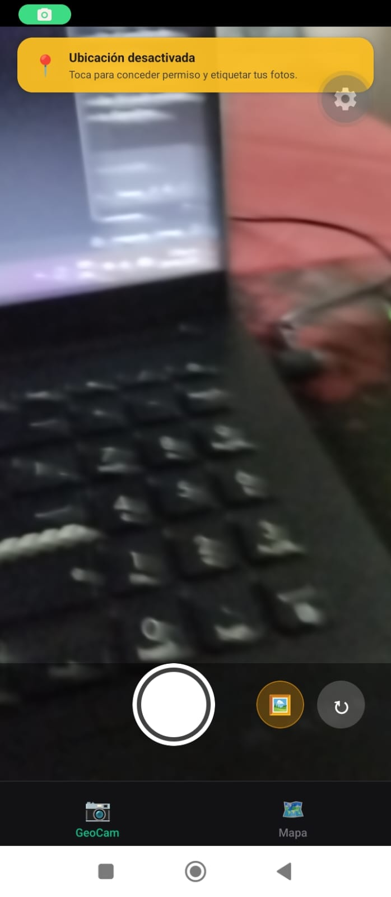
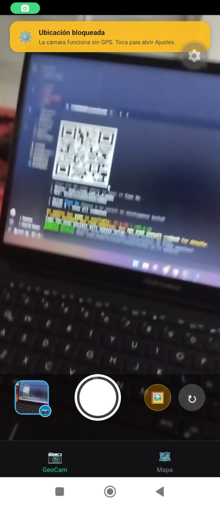
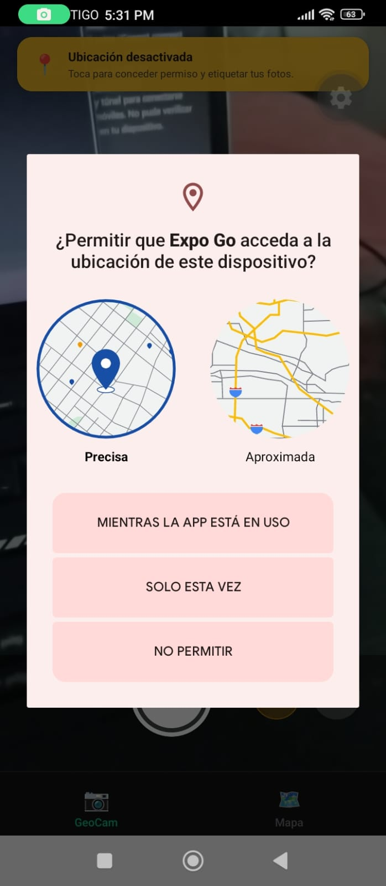
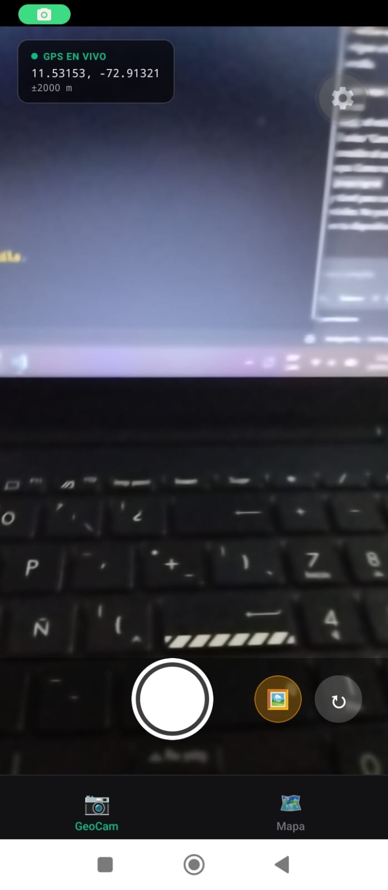
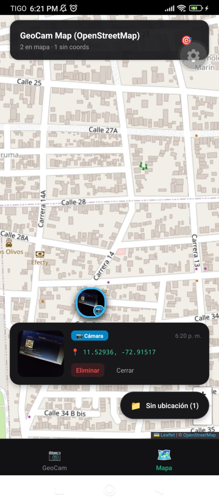

# GeoCam – Taller Integrador 2 (Semana 6)

Aplicación móvil desarrollada con **React Native** y **Expo Router (SDK 57)** que extiende la funcionalidad guiada de GeoCam a una arquitectura de dos pestañas: **GeoCam** (captura e importación de fotos geolocalizadas) y **Mapa** (visualización geográfica y gestión de fotos sin ubicación).

---

##  Pestañas y Funcionalidades

### 1. Pestaña GeoCam (`app/(tabs)/geocam.tsx`)
- **Captura con Cámara:** Utiliza la API moderna `CameraView` de `expo-camera` con controles posicionados como hermanos absolutos superpuestos.
- **Degradación Elegante:** Si el permiso de ubicación es denegado o bloqueado, la cámara continúa funcionando con total normalidad, guardando las fotos con `coords: null`. Un banner superior no intrusivo comunica el estado y permite solicitar el permiso o abrir los Ajustes del sistema.
- **R1 - Estado Global de Fotos:** Integración completa con `GeoPhotosContext`. Las capturas invocan `addPhoto` y actualizan la miniatura reactiva de la última foto.
- **R2 - Importación desde Galería:** Botón dedicado que usa `expo-image-picker` con la opción recomendada `mediaTypes: ['images']`. Las fotos importadas se guardan con `source: 'gallery'` y se distinguen visualmente de las de cámara mediante bordes y distintivos coloreados (🖼️ Galería en tono ámbar vs. 📷 Cámara en tono cian).

### 2. Pestaña Mapa (`app/(tabs)/mapa.tsx`)
- **R3 - Marcadores en Mapa:** Cada foto que cuenta con coordenadas se representa con un `Marker` interactivo personalizado con la miniatura de la imagen. Al pulsar sobre el marcador o su callout, se despliega una tarjeta de previsualización con la imagen, la fuente (`camera` vs `gallery`), fecha, coordenadas y opción de eliminar la foto.
- **Fotos Sin Ubicación:** Botón flotante que despliega una hoja modal con el listado detallado de todas las fotos capturadas o importadas sin coordenadas GPS, con fecha y botón para eliminar individualmente.
- **Centrado Inteligente:** El mapa se centra prioritariamente en la ubicación GPS en vivo del usuario; si el permiso de ubicación no está otorgado, se centra automáticamente en la última foto geolocalizada registrada.

### 3. Detección de Agitado (`hooks/useShake.ts`)
- **R4 - useShake Hook:** Suscripción al acelerómetro (`expo-sensors`) con intervalo configurado (100 ms), umbral de fuerza G y cooldown de 1000 ms para prevenir ráfagas de eventos. Al agitar el teléfono, un `Alert` interactivo pregunta al usuario si desea eliminar todas las fotos de la aplicación (`clearAll`).
- **Limpieza de Recursos:** Todas las suscripciones a acelerómetro y GPS se desuscriben inmediatamente (`.remove()`) al desmontarse la pantalla o cambiar de pestaña.

---

##  Estados de Permisos y Verificaciones

### Estados del Permiso de Cámara (`PermissionPrimer`)

| Concedido (Granted) | Rechazado (Denied) | Bloqueado (Blocked) |
|:---:|:---:|:---:|
|  |  |  |
| La cámara se inicializa y muestra el visor en tiempo real con controles y coordenadas en vivo. | Muestra la pantalla previa contextual con el botón **"Permitir acceso"** sin romper la navegación. | Muestra la pantalla explicativa indicando bloqueo con el botón **"Abrir Ajustes"** (`Linking.openSettings()`). |

> *Nota: Coloca tus capturas o GIFs correspondientes en `assets/images/permission_granted.png`, `assets/images/permission_denied.png` y `assets/images/permission_blocked.png`.*

### Verificaciones Requeridas Realizadas

1. **Negar la ubicación y verificar funcionamiento de la cámara:**
   - Al negar el permiso de ubicación, la cámara sigue activa, permitiendo capturar o importar fotos normalmente con `coords: null`. Se muestra un banner informativo que permite conceder el permiso en contexto.
2. **Negar la cámara dos veces en Android hasta llegar a `blocked`:**
   - La propiedad `canAskAgain === false` transiciona el estado a `'blocked'`. El componente `PermissionPrimer` muestra el botón **"Abrir Ajustes"**, el cual invoca `Linking.openSettings()`.
3. **Confirmación de cese de GPS en cleanup al cambiar de pestaña:**
   - Al navegar entre pestañas, el cleanup de `useEffect` en `useGeoLocation.ts` ejecuta `subscription.remove()` y emite en consola el log temporal:
     ```text
     [useGeoLocation] Deteniendo seguimiento GPS (cleanup)
     ```
4. **Tipado Estricto sin `any`:**
   - Todos los hooks (`useCamera`, `useGeoLocation`, `useShake`), contextos y componentes están completamente tipados con TypeScript estricto.

---

## 🗂️ Estructura del Proyecto

```text
├── AI-LOG.md                       # Registro de auditoría de IA (Semana 6)
├── README.md                       # Documentación del proyecto
├── app.json                        # Configuración de Expo y Plugins de permisos
├── package.json                    # Dependencias compatibles con Expo SDK 57
├── tsconfig.json                   # Configuración estricta de TypeScript
└── src/
    ├── app/
    │   ├── _layout.tsx             # Root layout con Stack y temas
    │   ├── index.tsx               # Redirección a /(tabs)/geocam
    │   └── (tabs)/
    │       ├── _layout.tsx         # Layout de tabs con GeoPhotosProvider y useShake
    │       ├── geocam.tsx          # Pantalla GeoCam (cámara, galería, estado)
    │       └── mapa.tsx            # Pantalla Mapa (markers, fotos sin ubicación)
    ├── components/
    │   └── PermissionPrimer.tsx    # Pantalla previa para permisos contextuales y bloqueados
    ├── context/
    │   └── GeoPhotosContext.tsx    # Estado global inmutable (addPhoto, removePhoto, clearAll)
    ├── hooks/
    │   ├── useCamera.ts            # Hook de cámara con CameraView y useCameraPermissions
    │   ├── useGeoLocation.ts       # Hook de ubicación con watchPositionAsync y cleanup
    │   └── useShake.ts             # Hook de acelerómetro con umbral y cooldown
    └── types/
        └── geo.ts                  # Interfaces y tipos de dominio (GeoPhoto, Coords, PermissionState)
```

---

##  Instalación y Ejecución

### Prerrequisitos
- Node.js (v18+)
- Expo CLI (`npx expo`)

### Pasos
1. **Instalar dependencias:**
   ```bash
   npm install
   ```

2. **Iniciar el servidor de desarrollo:**
   ```bash
   npx expo start
   ```

3. **Ejecutar en dispositivo o emulador:**
   - Presiona `a` en la terminal para Android Emulator o conecta tu dispositivo vía Expo Go / Development Build.
   - Presiona `i` para iOS Simulator.
   - Presiona `w` para Web.

4. **Verificar diagnóstico del proyecto:**
   ```bash
   npx expo-doctor
   ```

5. **Verificar tipos y linter:**
   ```bash
   npx tsc --noEmit
   npx expo lint
   ```
## Screenshots















