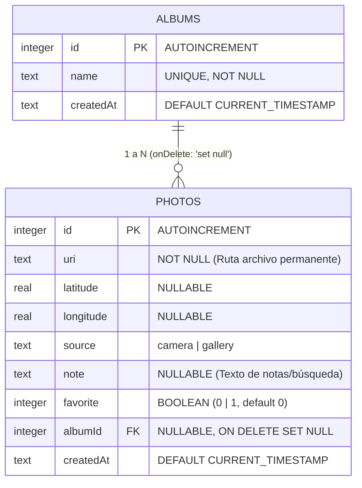
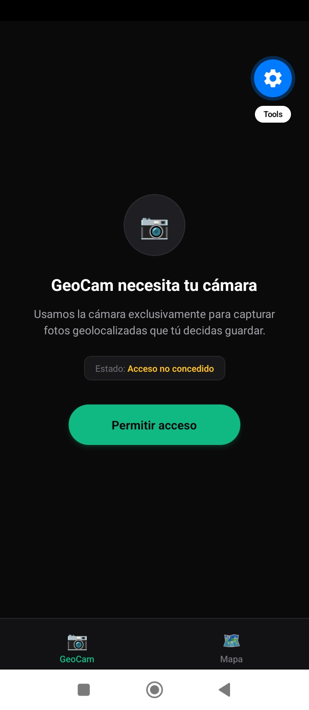

# GeoCam – Taller Integrador (Semana 6 + Módulo SQLite CRUD)

Aplicación móvil desarrollada con **React Native** y **Expo Router (SDK 57)** que integra captura e importación de fotos geolocalizadas, mapa interactivo con OpenStreetMap, y un **módulo CRUD completo y persistente en SQLite** potenciado por **Drizzle ORM** (`drizzle-orm` + `expo-sqlite`).

---

## 📊 Diagrama de Base de Datos (Esquema de Tablas y Relaciones)

El almacenamiento local se gestiona mediante SQLite con dos migraciones generadas automáticamente por Drizzle Kit (`0000_yellow_baron_zemo.sql` y `0001_condemned_stature.sql`).



### Reglas de Negocio & Persistencia:
- **`albums` (C1):** Colecciones de fotos con nombre único. Al eliminar un álbum, la relación en `photos.albumId` se establece en `NULL` (`onDelete: 'set null'`), conservando las fotos intactas.
- **`photos` (C2):** Incluye campos para geolocalización, notas personalizadas y estado favorito.
- **Archivos Permanentes (C5):** Al guardar una foto, se copia de la caché temporal a la carpeta de documentos persistentes de la app (`Paths.document/photos/`). Al eliminar el registro de la base de datos, el archivo en disco es eliminado automáticamente.

---

## ✨ Funcionalidades y Pestañas

### 1. Pestaña GeoCam (`app/(tabs)/geocam.tsx`)
- **Captura e Importación:** Captura desde cámara (`expo-camera`) e importación desde galería (`expo-image-picker`).
- **Persistencia Directa:** Transforma coordenadas y guarda directamente en SQLite mediante `usePhotos` / Repositorio `db/repositories/photos.ts`.
- **Filtros y Búsqueda en Vivo (C4):** Buscador por notas (`like`), selector de filtro por Álbum y filtro reactivo por Favoritas usando `useLiveQuery`.
- **Detalle de Foto (C3):** Pulsar cualquier miniatura navega a la pantalla completa de detalle `/foto/[id]`.

### 2. Pestaña Mapa (`app/(tabs)/mapa.tsx`)
- **Visualización OpenStreetMap Libre:** Marcadores reactivos generados con `withLocationQuery` (`isNotNull(photos.latitude)`).
- **Detalle & Navegación:** Pulsar en un marcador abre un card modal que permite ir directamente al CRUD completo en `/foto/[id]`.
- **Fotos Sin Ubicación:** Hoja modal desplegable con la lista reactiva de fotos sin GPS.

### 3. Pantalla de Detalle & CRUD Completo (`app/foto/[id].tsx`) (C3)
- **Edición de Nota:** Permite ingresar y guardar notas descriptivas sobre la foto.
- **Marca de Favorito:** Alternar estado favorito (❤️ / 🤍).
- **Asignación / Cambio de Álbum:** Picker para mover la foto entre álbumes existentes o crear un nuevo álbum en el acto.
- **Eliminación Segura:** Elimina la foto de SQLite y borra físicamente el archivo del almacenamiento local del dispositivo con confirmación vía `Alert`.

### 4. Detección de Agitado (`hooks/useShake.ts`)
- **Limpieza Completa:** Al agitar el dispositivo, solicita confirmación para vaciar la base de datos (`clearAll`) y eliminar todas las fotos persistidas en disco.

---

## 📁 Estructura del Proyecto

```text
├── drizzle/                        # Migraciones SQL generadas por drizzle-kit
│   ├── 0000_yellow_baron_zemo.sql # Migración inicial (tabla photos)
│   ├── 0001_condemned_stature.sql # Segunda migración (tabla albums, albumId, note, favorite)
│   └── meta/                       # Metadatos del diario de migraciones
├── db/                             # Capa de Base de Datos y Repositorios
│   ├── schema.ts                   # Definición de tablas SQLite y relaciones Drizzle
│   ├── client.ts                   # Instancia de expo-sqlite y drizzle
│   └── repositories/
│       ├── photos.ts               # Consultas listQuery, withLocationQuery, CRUD photos
│       └── albums.ts               # Consultas listAlbumsQuery, CRUD albums
├── services/
│   └── photoFiles.ts               # Gestión de archivos en Paths.document de expo-file-system
├── src/
│   ├── app/
│   │   ├── _layout.tsx             # Root layout protegido con useMigrations
│   │   ├── index.tsx               # Redirección a /(tabs)/geocam
│   │   ├── foto/[id].tsx           # Pantalla CRUD completa de detalle de foto (C3)
│   │   └── (tabs)/
│   │       ├── _layout.tsx         # Layout de tabs con useShake
│   │       ├── geocam.tsx          # Pantalla GeoCam con usePhotos y filtros
│   │       └── mapa.tsx            # Pantalla Mapa con marcadores reactivos
│   ├── components/
│   │   └── PermissionPrimer.tsx    # Pantalla previa para permisos contextuales
│   ├── hooks/
│   │   ├── usePhotos.ts            # Hook reactivo de fotos con useLiveQuery
│   │   ├── useAlbums.ts            # Hook reactivo de álbumes con useLiveQuery
│   │   ├── useCamera.ts            # Hook de cámara
│   │   ├── useGeoLocation.ts       # Hook de ubicación
│   │   └── useShake.ts             # Hook de acelerómetro
│   ├── utils/
│   │   └── photoMapper.ts          # Mapeador de DBPhoto a modelo GeoPhoto
│   └── types/
│       └── geo.ts                  # Interfaces y tipos de dominio
├── drizzle.config.ts               # Configuración de Drizzle Kit
├── babel.config.js                 # Configuración de Babel con Inline Import (SQL) y NativeWind
├── metro.config.js                 # Configuración de Metro para resolver archivos .sql
├── AI-LOG.md                       # Registro de auditoría de IA
└── README.md                       # Documentación del proyecto
```

---

## 🚀 Instalación y Ejecución

### Prerrequisitos
- Node.js (v18+)
- Expo CLI (`npx expo`)

### Pasos
1. **Instalar dependencias:**
   ```bash
   npm install
   ```

2. **Generar / Verificar Migraciones Drizzle:**
   ```bash
   npx drizzle-kit generate
   ```

3. **Iniciar servidor de desarrollo:**
   ```bash
   npx expo start
   ```

4. **Verificar diagnóstico y tipos:**
   ```bash
   npx expo-doctor
   npx tsc --noEmit
   npx expo lint
   ```

---

## 📸 Capturas de Pantalla y Capturas

